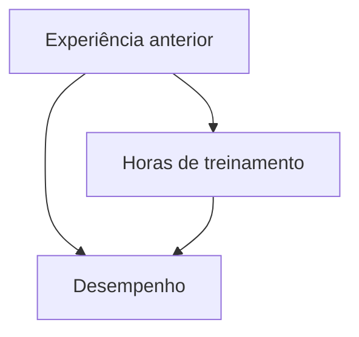

# Texto recebido do usuário na Parte 79 (Módulo 009), guardado como DADO

Sem código executável (um diagrama mermaid). Os nomes das três variáveis vieram vazios na cópia (": horas de treinamento", ": desempenho", ": experiência anterior"); pelo diagrama, são X, Y e Z.

### Módulo 009 — Raciocínio causal e descoberta de relações

Neste módulo, o protótipo vai aprender a separar três coisas que parecem semelhantes, mas não são: correlação, previsão e causalidade. A memória episódica do Módulo 008 registra o que aconteceu.
Agora, vamos usar esses registros para formular hipóteses sobre por que algo aconteceu, testar explicações alternativas e evitar conclusões que os dados não sustentam.

### 1. Lógica Criativa — perguntas causais
Quais variáveis mudaram antes do resultado? A relação observada pode ser coincidência? Existe uma terceira variável que explique as duas? O que aconteceria se alterássemos uma variável e
mantivéssemos as demais condições relevantes constantes? O resultado se repete em novas observações? A evidência permite concluir causalidade ou apenas associação? Qual experimento
distinguiria melhor duas explicações concorrentes?

### 2. Criatividade Lógica — modelo causal
Três variáveis: [X]: horas de treinamento; [Y]: desempenho; [Z]: experiência anterior. É possível que o treinamento melhore o desempenho. Mas pessoas com mais experiência anterior também podem
treinar mais e obter melhores resultados. Diagrama causal hipotético:

"Esse diagrama representa uma hipótese a investigar, não uma conclusão comprovada. A associação entre [X] e [Y], sozinha, não determina o efeito causal de [X] sobre [Y]. Precisamos considerar
variáveis de confusão, qualidade da medição e como os dados foram obtidos."

| Conceito | Pergunta respondida |
|---|---|
| Correlação | As variáveis variam juntas? |
| Previsão | Conhecer uma variável ajuda a prever outra? |
| Causalidade | Alterar uma variável produz mudança no resultado, nas condições estudadas? |

### 5. Como o sistema evita conclusões causais falsas?
Registrar a hipótese antes do teste (guardar a previsão original para evitar ajustar a explicação retrospectivamente). Definir a intervenção e o resultado. Procurar fatores de confusão. Estimar a
incerteza (amostras adequadas e intervalos de confiança, além da diferença entre médias). Tentar reproduzir o resultado. Limitar a conclusão: se o experimento não distinguir as explicações,
registrar "inconclusivo", em vez de escolher a hipótese preferida.

### 6. Integração com os módulos anteriores
Módulos 001–003 (memória semântica e grafo; o grafo causal acrescenta relações hipotéticas, sem tratá-las como fatos confirmados); 004–006 (evidência e probabilidades); 007–009
(experimentação e causalidade). "Isso é uma base de pesquisa experimental assistida por software, não evidência de que o sistema tenha alcançado inteligência geral."

### Próximo módulo — 010
Metacognição, calibração da confiança e detecção de erros: confiança declarada e precisão observada; detecção de contradições entre módulos; limiares para solicitar verificação independente;
comparação entre previsões e resultados; registro de falhas e revisão das estratégias. "A meta será tornar o protótipo mais capaz de reconhecer os próprios limites, em vez de apenas produzir
respostas com aparência de certeza."
